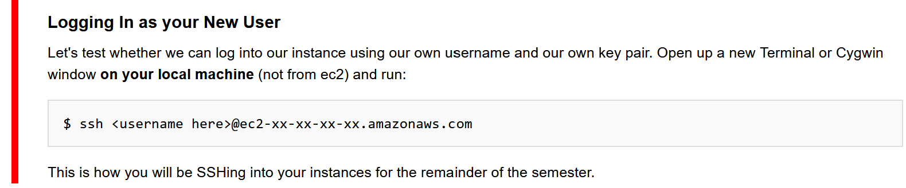

# Can't SSH using custom username?

## The issue
!

## First check...
- You have no copy-paste errors in `~/.ssh/authorized_keys`
- You have no accidental line breaks in `~/.ssh/authorized_keys`

## Still having problems? Have no fear, the solution is (hopefully) here!

If you have tried `ssh-add -l` and received an error:
> `Error connecting to agent: No such file or directory`
Maybe you try `ssh-add <path to id_rsa.pub` only to receive:
> `Error connecting to agent: No such file or directory`

## The Fix
[solution found here](https://unix.stackexchange.com/questions/464574/ssh-add-returns-with-error-connecting-to-agent-no-such-file-or-directory)

1. Open Windows PowerShell _as administrator_
2. Check status of ssh-agent using:
> `Get-Service | ?{$_.Name -like '*ssh-agent*'} | select -Property Name, StartType, Status`
3. Enable the service if it's disabled:
> `Set-Service -Name ssh-agent -StartupType Manual`
4. Start the service:
> `Start-Service ssh-agent`
5. Add your key (just like you tried to do before):
> `ssh-add <path to id_rsa.pub>`

Now, try again to ssh into your instance using your custom username:
> `ssh <custom_username>@<instance_address>`
